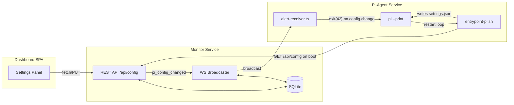

# Dashboard-Driven Pi Agent Configuration

> Saved from plan session — implement as a future task.

## Summary

Add a Settings panel to the monitor dashboard that lets users configure the pi-agent's LLM provider, model, and credentials at runtime — persisted in SQLite, fetched by the pi-agent on startup, with support for all direct API providers and both proxy extensions (pi-cursor-agent, pi-cliproxy).

## Todos

- [ ] Add better-sqlite3 to monitor, create configStore.ts with encrypted key-value storage
- [ ] Add REST API routes (GET/PUT /api/config/pi-agent) to the monitor broadcaster HTTP server
- [ ] Add PiConfigSchema and pi_config_changed message type to shared schemas
- [ ] Create SettingsPanel.tsx dashboard component with provider/model/credential form
- [ ] Add Settings tab to App.tsx, handle pi_config_changed in useMonitorSocket
- [ ] Rewrite entrypoint-pi.sh with restart loop that fetches config from monitor API
- [ ] Add pi_config_changed handler to alert-receiver.ts that triggers process.exit(42)
- [ ] Update Dockerfile (native deps), docker-compose (volume), render.yaml (persistent disk, secrets)

## Answers to Key Questions

**Will this only work with Anthropic?** No. The entrypoint already supports 8 providers (`anthropic`, `openai`, `google`, `openrouter`, `bedrock`, `cursor-agent`, `cliproxy`, `ollama`). But right now, switching providers requires changing Render env vars and redeploying. This plan makes it configurable from the dashboard.

**Does this need a DB?** Yes, a lightweight one. SQLite via `better-sqlite3` is the right fit — single file, no server process, zero ops burden. It persists config across restarts and can later store alert history if desired.

**Can you use proxy extensions in containers?**
- **pi-cursor-agent**: Yes. Initial login is interactive (browser), but once you have the OAuth tokens (`PI_CURSOR_ACCESS_TOKEN` / `PI_CURSOR_REFRESH_TOKEN` or `CURSOR_API_KEY`), they can be passed as env vars or stored in the config DB. The entrypoint already handles writing `auth.json`.
- **pi-cliproxy**: Yes, but it requires a running CLIProxyAPI instance somewhere reachable (e.g. a sidecar container, or an external host). The extension connects to `CLIPROXY_URL`. It cannot be self-contained — CLIProxyAPI is a separate Go binary that must be authenticated against your Claude Max subscription independently.

## Architecture

## Data flow for a config change

1. User picks a provider/model in the dashboard Settings panel and enters an API key
2. Dashboard PUTs to `GET/PUT /api/config/pi-agent` on the monitor
3. Monitor saves to SQLite, broadcasts `pi_config_changed` over WS
4. Pi-agent extension receives the message, gracefully exits pi with code 42
5. The entrypoint's restart loop detects exit code 42, fetches fresh config from the API, regenerates `~/.pi/agent/settings.json` + `auth.json`, and restarts pi

## Changes by Package

### 1. `packages/monitor` — REST API + SQLite

- **New dep**: `better-sqlite3` (+ `@types/better-sqlite3`)
- **New file**: `src/configStore.ts` — SQLite wrapper. Single `config` table with `key TEXT PRIMARY KEY, value TEXT, updated_at TEXT`. Functions: `getConfig(key)`, `setConfig(key, value)`, `getAllConfig()`. DB file at `data/monitor.db` (gitignored, Render persistent disk or ephemeral with env-var seeding fallback).
- **New file**: `src/configApi.ts` — Adds REST routes to the existing HTTP server in `broadcaster.ts`:
  - `GET /api/config/pi-agent` — returns current pi config (provider, model, credentials masked)
  - `PUT /api/config/pi-agent` — saves provider, model, and credentials; broadcasts `pi_config_changed` over WS
  - `GET /api/config/pi-agent/full` — returns unmasked credentials (used only by pi-agent entrypoint, guarded by a shared secret `CONFIG_API_SECRET`)
- **Modify**: `broadcaster.ts` — route non-WS requests through `configApi` handler before static file serving. Add `pi_config_changed` WS broadcast.

### 2. `packages/shared` — New schema types

- **Modify**: `alert.schema.ts` — Add `PiConfigSchema` (provider, model, credentials per provider type) and `pi_config_changed` to `WsMessageSchema`.

### 3. `packages/dashboard` — Settings panel

- **New file**: `src/components/SettingsPanel.tsx` — New tab in the dashboard:
  - Provider dropdown: Anthropic, OpenAI, Google, OpenRouter, Bedrock, Cursor Agent, CLIProxy, Ollama
  - Model text input (with suggested defaults per provider)
  - Credential fields (contextual per provider)
  - Save button that PUTs to `/api/config/pi-agent`
  - Connection status indicator for the pi-agent
  - Clear note: "Pi-agent will restart automatically when you save changes"
- **Modify**: `App.tsx` — Add "Settings" tab
- **Modify**: `useMonitorSocket.ts` — Handle `pi_config_changed` message type

### 4. `packages/pi-agent` — Config-aware restart loop

- **Modify**: `docker/entrypoint-pi.sh` — Wrap in a restart loop:
  1. Fetch config from `${MONITOR_URL}/api/config/pi-agent/full` (with `CONFIG_API_SECRET` header)
  2. If API is reachable and returns config, use it; otherwise fall back to env vars (current behavior)
  3. Generate `settings.json` + `auth.json` from fetched config
  4. Run `pi --print --no-session`
  5. If pi exits with code 42, loop back to step 1
  6. If pi exits with any other code, sleep 5s and loop (crash recovery)
- **Modify**: `extensions/alert-receiver.ts` — Listen for `pi_config_changed` WS message. On receipt, call `process.exit(42)` to trigger entrypoint restart.

### 5. Docker / Render

- **Modify**: `Dockerfile` — Add `better-sqlite3` native build deps to the build stage (`python3`, `make`, `g++` for node-gyp). Add a `data/` volume mount point.
- **Modify**: `docker-compose.yml` — Add a named volume for `data/` on the monitor service.
- **Modify**: `render.yaml` — Add a Render persistent disk for the monitor's SQLite data directory. Add `CONFIG_API_SECRET` env var to both services.

## Provider credential matrix

| Provider | Credentials |
|----------|-------------|
| anthropic | `ANTHROPIC_API_KEY` |
| openai | `OPENAI_API_KEY` |
| google | `GEMINI_API_KEY` |
| openrouter | `OPENROUTER_API_KEY` |
| bedrock | `AWS_ACCESS_KEY_ID`, `AWS_SECRET_ACCESS_KEY`, `AWS_REGION` |
| cursor-agent | `CURSOR_API_KEY` (headless) or `PI_CURSOR_ACCESS_TOKEN` + `PI_CURSOR_REFRESH_TOKEN` (OAuth) |
| cliproxy | `CLIPROXY_URL`, `CLIPROXY_API_KEY` (CLIProxyAPI must run externally) |
| ollama | `OLLAMA_HOST` |

## Security considerations

- API keys stored encrypted-at-rest in SQLite (AES-256 with `CONFIG_ENCRYPTION_KEY` env var)
- `/api/config/pi-agent/full` endpoint requires `CONFIG_API_SECRET` header
- Dashboard endpoint returns credentials masked (`sk-...****`)
- SQLite DB file is gitignored and excluded from Docker build context

## What this does NOT do

- Does not run CLIProxyAPI inside the container (separate Go service)
- Does not handle Cursor IDE interactive login (user obtains tokens externally)
- Does not auto-discover available models (pi handles that via `/model`)
